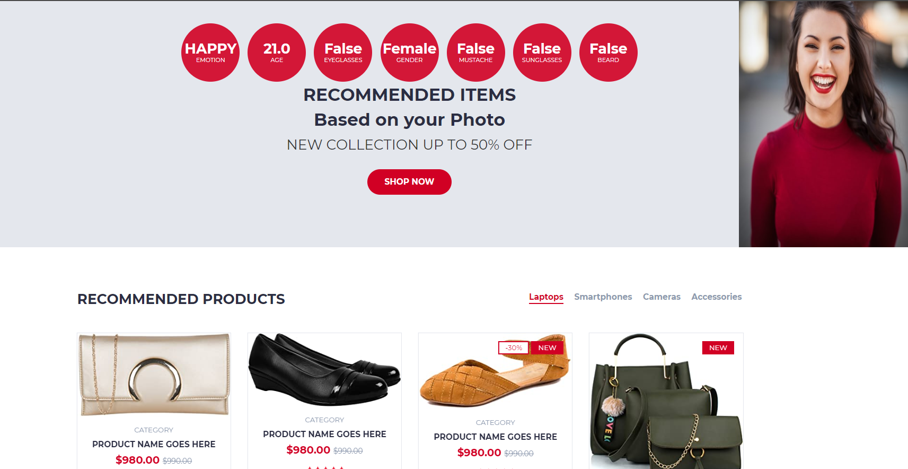
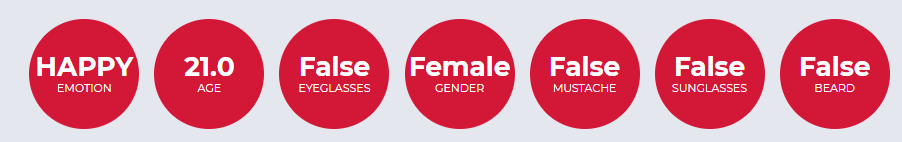
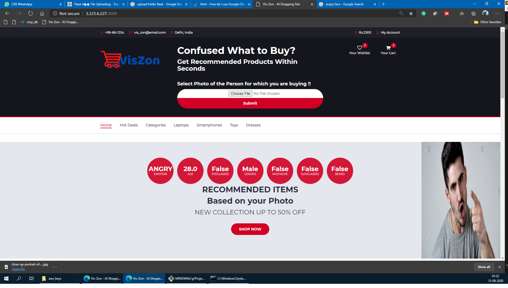

# Vis-Zon-Shopping-Platform

Server-Client Architecture for Detecting the duration of hand wash along with using AWS Facial Recognition to determine the identity of the person washing hands. This is to monitor Hand wash compliance.

## Repository Metadata ##

* Version: 1.1.0

## config.py Format ##

Add the following `config.py` file to the project folder and Fill the empty credentials before running the code

```python
# AWS S3 Credentials
AWS_REGION=''
AWS_ACCESS_ID=''
AWS_SECRET_KEY=''
```

## Steps to run the program ##

* Do Git Clone to clone the Repository.
* Add a `config.py` file in the project folder (Format Given Above) or can make changes in config_template.py rename it to config.py
* Install the dependencies by doing `pip install -r requirements.txt`
* run the `app_webpage.py` file and keep it running in one terminal.
* Arguments - default is host = localhost, port = 3000
  * If Running on local host
     * `python app_webpage.py --host localhost -p 3000`
  * If running on different server - replace it with your IP
     * `python app_webpage.py --host 3.4.5.6 -p 3000`
  
* Once the server is running without issues, open the link localhost:3000/
* Choose your image and upload it to the wesbite.
* Based on your image the system will suggest you products.

## Front Page


## Statistics


## Angry Person - Detection



## Who do I talk to? ##

* [Vinay Kumar Verma, Developer and Creator](mailto:vermavinay982@gmail.com ) - For Facial Recognition using AWS, Pipeline, Webpage Part
